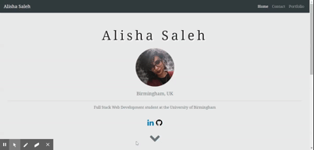
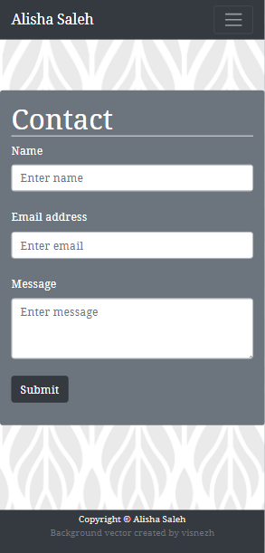

# Responsive Portfolio

## Description

In this project, I created a responsive mobile-first webpage using Bootstrap 4 as a framework. Features of this project include:
* A functioning and consistent Navbar 
* Three pages 
* Use of grid system
* Semantic and valid HTML
* Personalised content

This project has been updated (Feb 2021) with the following:
* An updated portfolio including web projects
* Links to professional social media
* Additional styling and hero added to Home Page

## Technologies used
* HTML
* CSS
* Bootstrap 4

## Credits

* <a href='https://www.freepik.com/vectors/background'>Background vector created by visnezh - www.freepik.com</a>
 
* Tremaine Eto on Medium: [Fade In CSS](https://medium.com/cloud-native-the-gathering/how-to-use-css-to-fade-in-and-fade-out-html-text-and-pictures-f45c11364f08)

## Screenshots

Below I have included screenshots to demonstrate the page and its responsiveness:

## URL

[Deployed URL](https://alishasaleh.github.io/responsivedesign/)

## License

Standard MIT License

