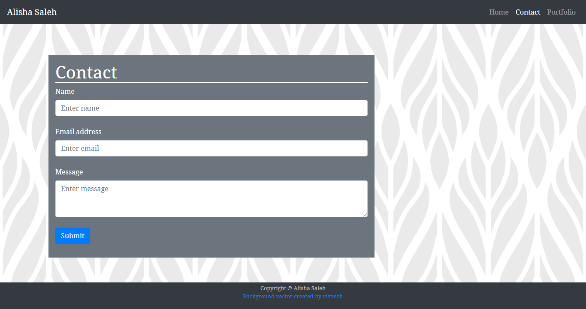
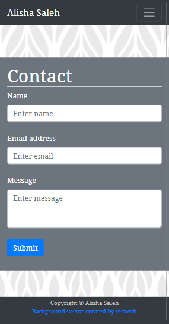

# responsivedesign

## Description

In this project, I created a responsive mobile-first webpage using Bootstrap 4 as a framework. Features of this project included:
* A functioning and consistent Navbar 
* Three pages 
* Use of grid system
* Semantic and valid HTML
* Personalised content

## Credits
 
* <a href='https://www.freepik.com/vectors/background'>Background vector created by visnezh - www.freepik.com</a>

* Bootstrap 4

## Screenshots

Below, I have included screenshots of one page to demonstrate desktop vs mobile responsiveness:

## URL

[Deployed URL](https://alishasaleh.github.io/responsivedesign/)
